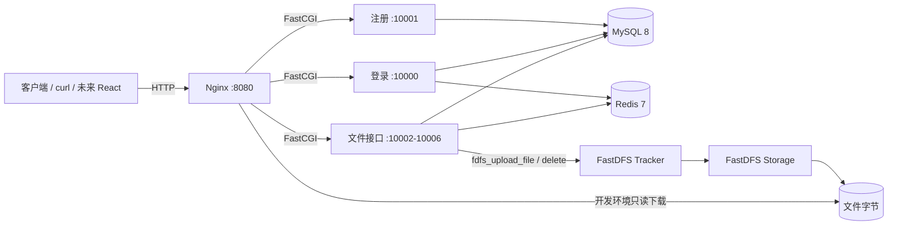
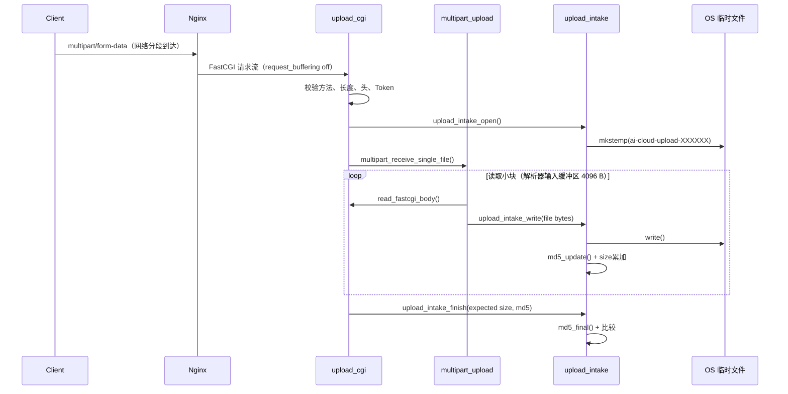
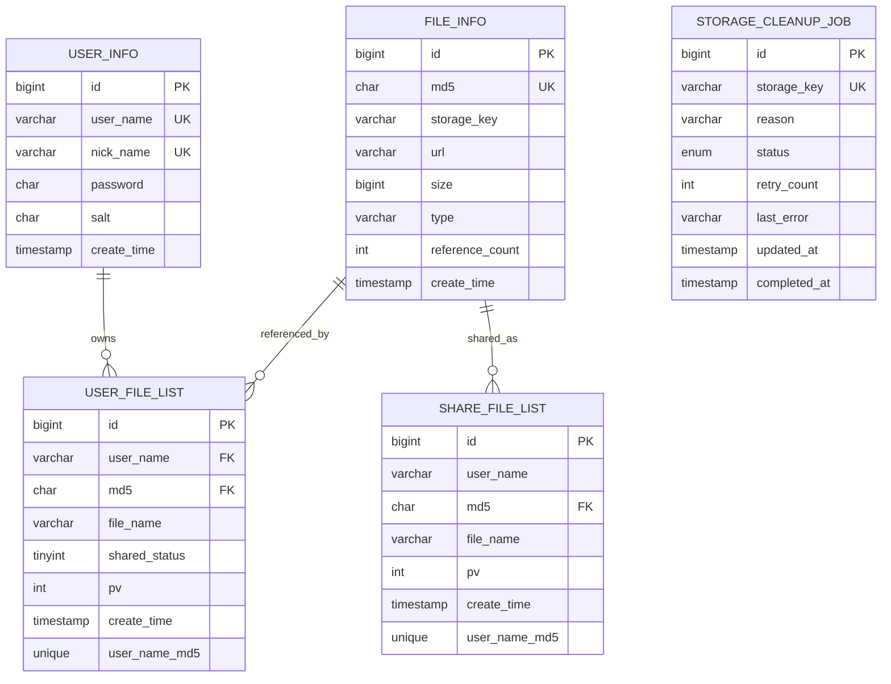

# AI Cloud Storage 项目全景、源码导读与面试手册

> 文档目标：让新的开发者或 AI 在较短时间内理解当前代码真实状态，也让项目作者能够按业务链路学习源码并准备面试。
>
> 代码基线：`main` 分支，截至“FastDFS 补偿删除失败持久化清理任务”实现（2026-09-19）。后续代码变更后应同步更新本文的“已实现能力”和“待办路线”。

## 0. 阅读约定：不要把规划当成实现

本文使用以下状态：

- ✅ **已实现**：已有可执行代码，并至少有单元测试或端到端测试覆盖。
- 🟡 **部分实现**：基础数据或内部函数存在，但还没有形成完整、可安全使用的对外能力。
- ⬜ **规划中**：仅有设计或 TODO，当前代码不可调用。

当前最容易被误解的三点：

1. 项目已经支持“流式接收一个 HTTP multipart 文件”，但**没有实现客户端大文件分片、断点续传和分片合并**。
2. 项目已经支持“分享/取消分享状态”，但**没有随机分享链接、过期时间、提取码、公开查看、转存和鉴权下载**。
3. 当前下载 URL 是开发环境中 Nginx 对单个 FastDFS storage 数据卷的只读映射，**不是生产级受控下载接口**。

---

## 1. 一分钟理解这个项目

这是一个使用 C11、FastCGI、MySQL、Redis、FastDFS、Nginx 和 Docker Compose 实现的私有云存储后端。它复刻原云存储项目的主链路，同时重点改进事务一致性、错误补偿、输入安全和可测试性。

客户端请求先到 Nginx。Nginx 按 URL 把请求交给不同端口上的 C FastCGI 进程。业务进程使用：

- MySQL 保存用户、全局物理文件元数据、用户文件关系和分享状态；
- Redis 保存有过期时间的登录 Token；
- FastDFS 保存文件字节；
- 本地临时文件承接上传流，并在写入过程中增量计算 MD5、统计大小；
- 数据库事务维护多个元数据之间的原子性；
- 补偿操作处理 MySQL 与 FastDFS 无法使用同一个事务的问题。



一句话区分各层职责：**FastDFS 保存内容，MySQL 保存“内容属于谁、叫什么、在哪里”，Redis 保存短期会话，Nginx 负责入口与转发，FastCGI 进程执行业务。**

---

## 2. 当前进度

### 2.1 已实现

| 模块 | 状态 | 当前能力 |
|---|---:|---|
| 注册 | ✅ | 用户名/昵称校验，随机盐，参数化 SQL，唯一冲突识别 |
| 登录 | ✅ | 查询盐和摘要、验证密码、生成 256-bit 随机 Token、Redis TTL |
| 登出 | ✅ | Redis Lua 原子校验所有者并删除；重复登出成功，具有幂等性 |
| 用户文件列表 | ✅ | Token 鉴权，返回最近 100 条用户文件及分享状态 |
| MD5 秒传 | ✅ | 命中全局 `file_info` 后，在事务中创建用户关系并增加引用数 |
| 安全上传接收 | ✅ | 单文件 multipart 流式解析、`mkstemp`、大小上限、服务端 MD5、失败清理 |
| FastDFS 上传 | ✅ | `fork/execvp` 调用 CLI，校验退出码和 storage key，返回下载 URL |
| 首次上传入库 | ✅ | `file_info` 与上传者 `user_file_list` 在一个 MySQL 事务中写入 |
| 跨系统失败补偿 | ✅ | 明确未入库时删除本次 FastDFS 对象；提交不明时先查询确认，避免误删 |
| 补偿失败持久化 | ✅ | 删除失败按 storage key 幂等入队，手动 worker 支持领取、重试、完成和 stale 恢复 |
| 同内容并发首传 | ✅ | MD5 唯一约束裁决胜者，失败方删除重复物理对象后关联胜者记录 |
| 用户逻辑删除 | ✅ | 事务内删除分享、用户文件关系并减少引用计数 |
| 分享/取消分享状态 | ✅/🟡 | 两张表事务同步已完成；完整分享链接和访问链路未实现 |
| 本地开发下载 | ✅/🟡 | Nginx 映射一个 storage 数据卷；无文件级鉴权 |
| 自动化测试 | ✅ | 6 组本地单元测试 + Docker 端到端主链路 |

### 2.2 当前尚未实现的主要能力

- ⬜ 客户端大文件分片、断点续传、秒级续传、分片合并和上传状态清理。
- ⬜ 可撤销、可过期、不可猜测的分享链接。
- ⬜ 分享提取码、访问频控、分享查看、分享下载和转存。
- ⬜ 私有文件和分享文件的统一鉴权下载。
- ⬜ 引用数归零后的 `file_info` 与 FastDFS 物理文件回收。
- ⬜ 用户文件重命名、分页、回收站和配额。
- ⬜ React 前端。
- ⬜ FAISS 用户级向量索引、图片描述、Embedding 和语义搜索。
- ⬜ 生产化 HTTPS、结构化日志、指标、限流、数据库/Redis 连接池和增量迁移体系。

---

## 3. 项目目录与阅读顺序

```text
AI_Cloud_Storage/
├── README.md                       # 启动方式和当前能力概览
├── Makefile                        # 构建 7 个 CGI、单元测试、E2E 入口
├── .env.example                    # 本地容器环境变量样例
├── src_cgi/                        # HTTP/FastCGI 入口层：读取请求、鉴权、响应
│   ├── reg_cgi.c                   # POST /api/reg
│   ├── login_cgi.c                 # POST /api/login
│   ├── logout_cgi.c                # POST /api/logout
│   ├── myfiles_cgi.c               # POST /api/myfiles
│   ├── md5_cgi.c                   # POST /api/md5
│   ├── dealfile_cgi.c              # 删除、分享、取消分享
│   └── upload_cgi.c                # 流式上传总入口和依赖组装
├── include/                        # 模块公开结构体、枚举和函数声明
├── common/                         # 可复用业务、仓储、协议和基础实现
│   ├── user_repository.c           # MySQL 用户读写
│   ├── token_service.c             # Redis Token 创建/验证/撤销
│   ├── file_repository.c           # 文件元数据事务
│   ├── cleanup_repository.c        # FastDFS 补偿清理任务状态机
│   ├── upload_intake.c             # 安全临时文件和流式校验
│   ├── multipart_upload.c          # 有限制的单文件 multipart 解析器
│   ├── upload_service.c            # 存储无关的首次上传编排与补偿
│   ├── storage_client.c            # 存储抽象的防御性包装
│   ├── fastdfs_storage_client.c    # FastDFS CLI 适配器
│   ├── md5.c                       # 项目自实现的流式 MD5
│   ├── json_util.c                 # 仅支持扁平字符串字段的最小 JSON 工具
│   ├── user_validation.c           # 输入校验、盐和密码摘要
│   ├── runtime_config.c            # FastCGI 进程启动时缓存环境配置
│   └── http_response.c             # 基础 JSON 响应
├── sql/
│   ├── init.sql                    # 新环境完整初始化结构
│   └── migrations/                 # 已部署数据库的增量迁移（当前含 cleanup job）
├── tools/cleanup_worker.c          # 手动领取并重试 FastDFS 删除任务
├── docker/
│   ├── docker-compose.yml          # MySQL/Redis/FastDFS/App/Nginx 编排
│   ├── nginx/nginx.conf            # URL 到 FastCGI 端口的映射
│   ├── fastcgi_app/start.sh        # 启动 7 个独立 FastCGI 程序
│   └── fastdfs/                    # tracker/storage/client 配置与启动脚本
├── conf/                           # FastDFS client 配置样例
├── tests/                          # 单元测试、仓储探针和 Docker E2E
└── docs/PROJECT_GUIDE.md           # 本文
```

建议阅读顺序：

1. `sql/init.sql`：先理解数据模型。
2. `docker/nginx/nginx.conf` 与 `docker/fastcgi_app/start.sh`：理解一个 URL 如何找到一个 C 程序。
3. `src_cgi/reg_cgi.c`、`login_cgi.c`、`logout_cgi.c`：熟悉最简单的请求链。
4. `src_cgi/md5_cgi.c` + `common/file_repository.c`：理解秒传事务。
5. `src_cgi/upload_cgi.c`：理解上传主编排。
6. `multipart_upload.c` → `upload_intake.c` → `upload_service.c` → `fastdfs_storage_client.c`：逐层深入上传实现。
7. `tests/test_upload_service.c` 与 `tests/e2e_auth.sh`：从断言反向理解设计目标。

`LOCAL_PROJECT_PLAN.md` 是被 `.gitignore` 忽略的个人实施计划，不是远端源码事实。AI 接手时应以本文、头文件、实现和测试共同为准。

---

## 4. 运行时进程模型与技术栈

### 4.1 技术栈

| 分类 | 技术 | 在项目中的用途 |
|---|---|---|
| 语言 | C11 | CGI、业务编排、协议解析、数据访问、MD5 |
| Web 入口 | Nginx 1.27 | 路由、请求体限制、FastCGI 转发、开发下载映射 |
| 应用协议 | FastCGI / libfcgi | Nginx 与常驻 C 业务进程之间传递 HTTP 请求信息 |
| 关系数据库 | MySQL 8 / InnoDB | 用户、文件元数据、用户文件关系、分享状态和事务 |
| 缓存/会话 | Redis 7 / hiredis | `token:<随机token> -> user`，带 TTL |
| 文件存储 | FastDFS | tracker 调度与 storage 文件保存 |
| 数据库客户端 | MySQL C API | 连接、Prepared Statement、事务 |
| 操作系统接口 | POSIX | `mkstemp`、`read/write`、`fork/execvp`、`unlink` |
| 部署 | Docker Compose | 一键启动开发所需的 6 类服务 |
| 测试 | C 测试程序 + Shell/curl | 模块单测与真实依赖端到端测试 |

### 4.2 FastCGI 在本项目中的准确含义

FastCGI 不是文件系统，也不是业务框架。它是 Web Server 和应用程序之间的通信协议。这里：

1. Nginx 接收客户端 HTTP 请求；
2. Nginx 根据 location 把环境变量、请求头和请求体通过 FastCGI 转发；
3. `spawn-fcgi` 让每个 C 可执行文件常驻并监听一个端口；
4. C 程序在 `while (FCGI_Accept() >= 0)` 中逐个处理请求；
5. 程序从 `getenv()` 读取请求元数据，从 FastCGI 包装后的 `stdin` 读取请求体，向 `stdout` 写 CGI 响应。

当前不是一个进程内的统一路由器，而是 **7 个独立的 FastCGI 程序**：

| 端口 | 可执行文件 | API |
|---:|---|---|
| 10000 | `login` | `/api/login` |
| 10001 | `register` | `/api/reg` |
| 10002 | `myfiles` | `/api/myfiles` |
| 10003 | `md5` | `/api/md5` |
| 10004 | `dealfile` | `/api/dealfile` |
| 10005 | `logout` | `/api/logout` |
| 10006 | `upload` | `/api/upload` |

### 4.3 FastDFS 在本项目中的准确含义

FastDFS 是物理文件存储系统：

- tracker 负责发现 storage、调度上传位置；
- storage 保存真实文件字节并返回类似 `group1/M00/...` 的 storage key；
- 应用把 storage key 和可访问 URL 存入 `file_info`；
- 项目当前通过 FastDFS 自带命令行客户端操作，并没有直接链接 FastDFS C Client API。

`fastdfs_storage_client.c` 使用 `fork()` 创建子进程，使用 `execvp()` 直接执行参数数组：

```c
fdfs_upload_file <client.conf> <local_temp_path>
fdfs_delete_file <client.conf> <storage_key>
```

参数不经 Shell 字符串拼接，降低了命令注入风险。适配器还检查进程退出状态、storage key 格式并安全拼接公开 URL。

---

## 5. API 设计与当前契约

除 `/api/upload` 使用 multipart 和自定义请求头外，其余接口接收小型 JSON。基础响应形如：

```json
{"code": 0, "msg": "...", "token": "..."}
```

注意：当前 `code` 是项目自定义业务码，HTTP 状态基本没有细分；这在生产化阶段应改进。

### 5.1 接口总表

| 方法与路径 | 鉴权 | 请求关键字段 | 成功效果 |
|---|---|---|---|
| `POST /api/reg` | 否 | `user,nickname,password` | 新增用户；`password` 是客户端 32 位 MD5 |
| `POST /api/login` | 否 | `user,password` | 验证后创建 Redis Token |
| `POST /api/logout` | 是 | `user,token` | 原子撤销当前 Token；重复请求成功 |
| `POST /api/myfiles` | 是 | `user,token` | 返回该用户最近 100 个文件 |
| `POST /api/md5` | 是 | `user,token,md5,file_name` | 命中全局物理文件时建立用户关系，完成秒传 |
| `POST /api/upload` | 是 | 4 个 `X-Upload-*` 头 + `file` part | 接收、校验、上传 FastDFS、事务入库 |
| `POST /api/dealfile?cmd=del` | 是 | `user,token,md5` | 删除用户关系并减少引用数 |
| `POST /api/dealfile?cmd=share` | 是 | `user,token,md5` | 创建分享记录并置 `shared_status=1` |
| `POST /api/dealfile?cmd=unshare` | 是 | `user,token,md5` | 删除分享记录并置 `shared_status=0` |

### 5.2 注册

请求：

```json
{"user":"alice","nickname":"Alice","password":"5f4dcc3b5aa765d61d8327deb882cf99"}
```

服务端流程：

```text
reg_cgi.main
  -> json_get_string + validate_*
  -> create_salt                     // /dev/urandom 读取 16 字节，编码为 32 hex
  -> make_password_digest            // MD5(salt || client_password_md5)
  -> create_user                     // Prepared Statement INSERT user_info
  -> write_json_response
```

`salt` 不是另一张表，每个用户的随机盐就在 `user_info.salt`。它让相同密码的用户得到不同数据库摘要，并削弱预计算彩虹表。但 **MD5 不适合作为生产密码哈希**，后续应改为 Argon2id、scrypt 或 bcrypt，并让服务端处理原始密码的安全传输和哈希。

### 5.3 登录与登出

登录链：

```text
login_cgi.main
  -> find_user_credentials(user)
  -> make_password_digest(db.salt, client_password_md5)
  -> 常量语义上的字符串比较（当前为 strcmp）
  -> create_session_token
       -> /dev/urandom 读取 32 字节 -> 64 hex
       -> SETEX token:<token> <ttl> <user>
```

登出使用 Redis Lua 脚本把“读取所有者、比较用户、删除 key”合成一个原子操作：

```text
不存在                -> 成功（允许安全重试）
owner == 当前 user     -> DEL，成功
owner != 当前 user     -> 拒绝，不能删除别人的 Token
```

一次登录创建一个独立 Token，所以一个设备登出不会删除其他设备 Token。

### 5.4 文件列表

查询把用户侧信息和全局物理信息连接起来：

```sql
SELECT u.md5, u.file_name, f.url, f.size, f.type,
       u.shared_status, u.create_time
FROM user_file_list u
JOIN file_info f ON f.md5 = u.md5
WHERE u.user_name = ?
ORDER BY u.create_time DESC
LIMIT 100;
```

返回字段来自两个不同层次：文件名和分享状态属于用户关系；URL、大小、类型属于全局物理文件。

### 5.5 MD5 秒传

“秒传”不是重新上传文件，而是复用已经存在的物理内容：

```text
md5_cgi.main
  -> 校验 user/token/md5/file_name
  -> verify_session_token
  -> claim_existing_file
       BEGIN
       SELECT storage_key,url FROM file_info WHERE md5=? FOR UPDATE
       INSERT user_file_list(user_name, md5, file_name)
       UPDATE file_info SET reference_count=reference_count+1
       COMMIT
```

`FOR UPDATE` 锁定全局文件行，使关系插入与引用数增加在并发下保持一致。`UNIQUE(user_name, md5)` 防止同一用户重复拥有并重复增加引用数。

当前重要安全边界：接口只要知道一个全局 MD5 就能尝试认领文件。MD5 不是访问凭证，因此在分享功能对外开放前必须加入“已有所有权或有效分享授权”的限制。普通上传仍可在服务端验证真实字节后做物理去重。

### 5.6 普通上传

示例：

```bash
curl -X POST http://localhost:8080/api/upload \
  -H "X-Upload-User: alice" \
  -H "X-Upload-Token: <64-hex-token>" \
  -H "X-Upload-MD5: <32-hex-md5>" \
  -H "X-Upload-Size: <file-bytes>" \
  -F "file=@./demo.txt"
```

约束：

- 只接受 `POST`；
- 只接受一个名为 `file` 的 multipart 文件 part；
- 应用默认最大文件 10 MiB；Nginx 请求体最大 12 MiB；
- multipart 额外开销最多接受 64 KiB；
- 文件名最多 128 字节，不能含 `/`、`\` 或控制字符；
- 客户端声明的 MD5 和大小必须与服务端接收结果一致。

---

## 6. 上传的完整函数链

### 6.1 从网络到临时文件



客户端（例如浏览器或 curl）和 TCP/HTTP 栈本身会分段发送字节，服务端不要求先把 1 GB 完整装入内存。当前项目的“分块写入”是**服务器流式 I/O 的内存块**，不是具有 chunk ID、可单独重试的产品级分片上传。

`mkstemp` 是 POSIX 接口。模板末尾的 `XXXXXX` 会被替换为不可预测的唯一字符，并以独占方式创建文件，避免固定路径冲突。用户原始文件名不会用于临时路径。

### 6.2 MD5 为什么可以 update

MD5 是按 64 字节块工作的流式哈希。`Md5Context` 保存：

```c
typedef struct {
    uint32_t state[4];
    uint64_t bits;
    unsigned char buffer[64];
} Md5Context;
```

`md5_update` 不是“把每段 MD5 拼起来”，而是把新字节继续送入同一个哈希状态：

```text
init 初始状态
  -> update(第 1 段原始字节)
  -> update(第 2 段原始字节)
  -> ...
  -> final(补位和长度)
```

最终结果等于一次性对完整文件计算 MD5，但内存中只需保留当前状态和不足 64 字节的尾部。项目的 MD5 算法由 `common/md5.c` 自己实现，不依赖 OpenSSL。

### 6.3 从临时文件到 FastDFS 和 MySQL

```text
upload_cgi.handle_upload_request
  -> multipart_receive_single_file
  -> upload_intake_finish
  -> fastdfs_storage_client_init
  -> execute_first_upload
       -> storage_client_upload
            -> FastDFS adapter upload_file
                 -> fork/execvp fdfs_upload_file
                 -> StoredObject{storage_key,url}
       -> repository.record
            -> record_new_file_upload
                 BEGIN
                 INSERT file_info(reference_count=1)
                 INSERT user_file_list
                 COMMIT
       -> 成功后返回 URL
  -> received_upload_discard          // 无论业务成功失败都删除本地临时文件
```

### 6.4 首次上传为什么既要事务又要补偿

MySQL 事务只能回滚 MySQL，不能自动回滚已经写入 FastDFS 的文件。因此使用“本地事务 + 补偿”模式：

```text
FastDFS 上传成功
  |
  +-- MySQL 两表事务成功
  |     -> 返回成功，保留物理对象
  |
  +-- MySQL 明确失败/回滚
  |     -> fdfs_delete_file 删除本次上传对象
  |          +-- 删除失败：按 storage_key 幂等写入 storage_cleanup_job
  |
  +-- mysql_commit 返回错误，结果未知
        -> 查询 user + md5 + storage_key 是否已提交
             +-- 存在：视为成功，绝不能删
             +-- 不存在：删除本次对象；删除失败则写入 cleanup job
             +-- 查询也失败：保留对象，返回 COMMIT_UNRESOLVED
```

“提交返回错误”不等于“提交一定没发生”：可能数据库已经提交，只是响应在网络中丢失。如果此时直接删除 FastDFS 文件，数据库会指向不存在的对象。当前代码选择宁可暂时留下可能的孤儿，也不误删可能已被引用的对象。

### 6.5 两个用户同时首次上传相同内容

假设 Alice 和 Bob 同时上传字节相同、MD5 相同的文件：

```text
Alice 上传 FastDFS 得到 object-A    Bob 上传 FastDFS 得到 object-B
             |                                  |
             +---- 同时 INSERT file_info(md5) --+
                              |
                   UNIQUE(file_info.md5) 裁决
                    /                       \
              Alice 成功                 Bob 1062 冲突
                 |                            |
           提交 A + Alice关系          删除 object-B
                                              |
                                  等待并锁定已提交的 file_info
                                              |
                                  插入 Bob关系 + 引用数加 1
                                              |
                                  两人都返回 object-A 的 URL
```

最终不变量：

- FastDFS 只多一个物理对象；
- `file_info` 只有一行；
- `user_file_list` 有 Alice、Bob 两行；
- `reference_count = 2`；
- 两个响应 URL 相同。

这一点是项目当前最有面试价值的实现之一：它不靠“先查再写”的脆弱判断，而是让数据库唯一约束作为并发最终裁判，再做失败方收敛。

---

## 7. 核心结构体与抽象

### 7.1 认证与用户

| 结构体 | 关键字段 | 含义 |
|---|---|---|
| `UserCredentials` | `password_digest[33]`, `salt[33]` | 从 MySQL 读取的登录验证材料 |
| `Md5Context` | `state[4]`, `bits`, `buffer[64]` | 可多次 update 的 MD5 中间状态 |

### 7.2 文件元数据

| 结构体/枚举 | 用途 |
|---|---|
| `UserFile` | `/api/myfiles` 的一条组合结果，包含用户文件名和全局 URL/大小 |
| `SharedFile` | 分享列表结果模型；`list_shared_files` 已有内部实现，但当前无公开头文件声明和 API 路由 |
| `FileLocation` | 仅返回已存在对象的 `storage_key` 与 `url` |
| `NewFileRecord` | 首次上传即将写入 MySQL 的完整参数视图 |
| `ClaimFileResult` | 秒传结果：已关联、物理不存在、已拥有、数据库失败 |
| `RecordNewFileResult` | 首传入库结果：成功、物理冲突、DB 失败、提交未知等 |

### 7.3 安全文件接收

```c
typedef struct {
    int descriptor;
    int active;
    uint64_t size;
    uint64_t max_size;
    char path[512];
    Md5Context md5;
} UploadIntake;
```

`UploadIntake` 是“正在接收”的可变状态，负责临时文件句柄、累计大小、上限和 MD5 状态。完成后转交为：

```c
typedef struct {
    char path[512];
    char md5[33];
    uint64_t size;
} ReceivedUpload;
```

这种拆分表达了所有权变化：`finish` 成功后，临时路径由 `ReceivedUpload` 持有；调用方最终必须 `received_upload_discard`。

`MultipartFileInfo` 只保留经过解析的原始文件名和 media type。当前真正写入 `file_info.type` 的类型来自文件扩展名，且只允许最多 32 个字母数字字符；media type 尚未入库。

### 7.4 存储抽象

```c
typedef struct {
    void *context;
    int (*upload)(void *context, const char *local_path, StoredObject *out);
    int (*remove)(void *context, const char *storage_key);
} StorageClient;
```

`StorageClient` 是 C 语言手写的依赖反转接口。`upload_service.c` 只依赖回调，不知道 FastDFS 细节，所以单元测试可注入假存储并模拟上传失败、删除失败和重复对象。

`FastDfsStorageContext` 保存配置路径、公开基础 URL、命令名和可注入的命令运行器。测试可替换 command runner，不真正创建子进程。

### 7.5 上传仓储抽象与编排参数

```c
typedef struct {
    void *context;
    RecordNewFileResult (*record)(...);
    int (*confirm)(...);
    ClaimFileResult (*claim_existing)(...);
    int (*schedule_cleanup)(...);
} UploadRepository;
```

- `record`：尝试写首传的两张表；
- `confirm`：处理 COMMIT 结果未知；
- `claim_existing`：处理并发 MD5 冲突后关联胜出对象。
- `schedule_cleanup`：即时物理删除失败后持久化重试任务。

`FirstUploadRequest` 是编排器输入；`FirstUploadResult` 把存储失败、数据库失败、清理失败和提交无法确认分开。错误分类比单一 `-1` 更利于补偿、告警和 API 映射。

---

## 8. 数据库设计

### 8.1 关系图



### 8.2 表职责

#### `user_info`

一行表示一个账号。`salt` 是每用户随机值，和密码摘要一起存放，不需要保密。`user_name`、`nick_name` 都唯一。

#### `file_info`

一行表示一份全局去重后的物理内容：

- `md5`：当前去重键，唯一；
- `storage_key`：FastDFS 返回的位置标识；
- `url`：当前开发下载地址；
- `size/type`：内容元数据；
- `reference_count`：多少条用户文件关系正在引用它。

两个用户拥有相同内容时，`file_info` 仍只有一行。

#### `user_file_list`

一行表示“某个用户拥有某份内容”：

- 同一 MD5 在不同用户下可以有不同 `file_name`；
- `(user_name, md5)` 唯一，当前同一用户不能把相同内容以两个名字保存两次；
- `shared_status` 是用户这份逻辑文件的分享展示状态；
- `pv` 当前未形成完整业务闭环。

#### `share_file_list`

当前一行表示某用户把某 MD5 标记为分享。它和 `user_file_list.shared_status` 是冗余的两份状态，由事务同步。

当前缺陷：没有 `share_id`、过期时间、提取码哈希，也没有外键直接指向所有者的 `user_file_list.id`；`user_name/file_name` 是冗余文本。未来应以逻辑文件关系作为分享主体。

#### `storage_cleanup_job`

保存已经确认不应保留、但即时 FastDFS 删除失败的对象：

- `storage_key` 唯一，重复调度不会制造多条任务；
- `pending` 表示可领取，`running` 表示 worker 已领取，`done` 表示删除完成；
- 删除失败会回到 `pending` 并增加 `retry_count`；
- running 超过五分钟可由下一次 worker 启动恢复，避免进程崩溃后永久卡住；
- 任务没有 `file_info` 外键，因为其典型目标正是未成功入库的孤儿对象。

新环境由 `init.sql` 创建；已有环境执行 `sql/migrations/001_storage_cleanup_job.sql`。

### 8.3 必须长期维护的不变量

理想状态下：

```text
file_info.reference_count
  == SELECT COUNT(*) FROM user_file_list WHERE md5 = file_info.md5
```

同时：

- 每个 `user_file_list.md5` 必须对应一个 `file_info`；
- 分享记录必须对应分享者真实拥有的用户文件；
- 有效分享不能只看 `shared_status`，还应看分享记录存在、未撤销、未过期；
- 分享记录本身不增加物理文件引用数；转存创建用户文件关系时才增加；
- 引用数归零后才能回收物理文件，但回收需要跨 MySQL/FastDFS 的可靠补偿流程。

### 8.4 当前事务边界

| 操作 | 同一事务中的动作 | 事务外动作 |
|---|---|---|
| 首次上传 | 插入 `file_info` + 插入上传者关系 | 先上传 FastDFS；失败时补偿删除 |
| 删除补偿失败 | 幂等写入/领取/更新 `storage_cleanup_job` | worker 重试 `fdfs_delete_file` |
| 秒传/认领 | 锁文件 + 插入用户关系 + 引用数 `+1` | 无 |
| 用户删除 | 删除分享 + 删除用户关系 + 引用数 `-1` | **尚未在归零时删除 FastDFS** |
| 分享 | 插入分享记录 + `shared_status=1` | 无 |
| 取消分享 | 删除分享记录 + `shared_status=0` | 无 |
| 登出 | Redis Lua 内原子比较与删除 | 无 |

---

## 9. 分享功能：现在有什么、未来应怎样工作

### 9.1 当前真实效果

Alice 调用 `cmd=share` 后：

1. 从 Alice 的 `user_file_list` 复制 `user_name/md5/file_name` 到 `share_file_list`；
2. 将 Alice 的 `user_file_list.shared_status` 改为 1；
3. 两步在同一事务中提交；
4. `/api/myfiles` 能看到 `shared_status: 1`。

调用 `cmd=unshare` 后，分享记录删除且状态变为 0。当前没有其他 API 根据这条记录提供公开查看、下载或保存，所以它还是“分享状态基础”，不是完整产品能力。

`file_repository.c` 末尾已经存在内部 `list_shared_files` 实现，但它没有在公开头文件中声明，也没有 CGI/Nginx 路由；不能视为已发布接口。

### 9.2 规划中的正确分享语义

Alice 创建分享链接后应生成高熵随机 `share_id`。Bob 使用链接时，服务端每次校验记录存在、未撤销、未过期，必要时再验证提取码。

Bob 点击“保存到我的文件”时：

```text
BEGIN
锁定并验证 share_id 有效
锁定对应 file_info
INSERT Bob 的 user_file_list(shared_status=0)
UPDATE file_info SET reference_count=reference_count+1
COMMIT
```

如果 Alice 之后取消分享：

- 未转存的 Bob 不能再通过旧分享访问；
- 已经转存的 Bob 仍拥有独立的 `user_file_list`，继续有效；
- Alice 删除自己的文件也不影响 Bob；
- 物理内容只有在所有用户关系都删除后才有资格回收。

这个设计把“分享访问权”和“文件所有关系”分离，能清楚回答撤销、转存和引用计数问题。

---

## 10. 测试与验证

### 10.1 本地单元测试

```bash
make test
```

当前依次编译和执行：

- JSON 工具测试；
- MD5、输入校验、盐/摘要辅助测试；
- 首次上传编排和补偿测试；
- FastDFS 适配器测试；
- 临时文件接收测试；
- multipart 流式解析测试。

编译标志为：

```text
-std=c11 -Wall -Wextra -Werror
```

### 10.2 Docker 端到端测试

```bash
make e2e
```

E2E 会启动真实 MySQL、Redis、FastDFS tracker/storage、FastCGI 和 Nginx，覆盖：

- 注册、登录、Redis Token 所有者；
- 真实 multipart 上传、FastDFS 保存、URL 下载和字节一致性；
- 首次上传两表事务状态；
- 临时文件清理；
- 两用户并发上传相同内容并收敛为一个物理文件；
- 秒传未命中、成功和重复拥有；
- 文件列表、分享、重复分享、取消分享、重复取消；
- 删除关系；
- 登出、旧 Token 拒绝、重复登出；
- 错误密码拒绝。

### 10.3 新功能的最低验收原则

任何修改引用数、分享状态或物理文件生命周期的功能，都不应只测试 HTTP 返回值；还必须直接断言：

- `file_info` 行数、storage key 和引用数；
- `user_file_list` 与 `share_file_list` 的准确行数；
- FastDFS 物理文件数；
- 重复请求和并发请求后的最终状态；
- 失败注入后的补偿结果。

---

## 11. 未来实现路线（按收益和依赖排序）

### P0：先补一致性与安全底座

1. ✅ **持久化清理任务**：FastDFS 删除补偿失败时写入 MySQL cleanup job，支持幂等手动重试、错误原因、重试次数和 stale 任务恢复。定时调度尚未接入。
2. **堵住 MD5 越权秒传**：仅凭全局 MD5 不得认领他人私有文件；允许上传真实字节后由服务端校验并去重。
3. **引用归零回收**：用户删除后若引用数为 0，可靠删除 FastDFS 和 `file_info`；必须处理“数据库提交与存储删除无法同事务”的状态机。
4. **幂等协议统一**：秒传、取消分享、未来转存和删除定义稳定的重复请求语义，并补双请求并发测试。
5. **对账工具**：检查 `reference_count` 与实际关系数、数据库对象与 FastDFS 对象的差异。

### P1：完成真正可用的分享闭环

1. 给 `share_file_list` 增加随机唯一 `share_id`、`expires_at`、所有者 `user_file_id`，通过增量 migration 升级。
2. `POST /api/shares` 创建；`GET /api/shares/{share_id}` 查看；`DELETE` 撤销。
3. `POST /api/shares/{share_id}/save` 登录后转存，事务内验证分享、插入关系、增加引用数。
4. 增加受控下载入口；私有 FastDFS 路径不再直接公网暴露。
5. 增加提取码哈希、Redis 错误次数限制和有效期。
6. 下载通过后原子 `pv = pv + 1`，明确它统计请求而非完整传输完成次数。

### P2：大文件分片与断点续传

建议接口：

- `POST /api/uploads/init`：返回 `upload_id`、chunk size 和已存在分片；
- `PUT /api/uploads/{upload_id}/chunks/{index}`：上传可重试分片；
- `POST /api/uploads/{upload_id}/complete`：验证完整性、合并或提交；
- `DELETE /api/uploads/{upload_id}`：取消；
- 后台清理超时上传。

Redis 可保存短期上传状态，但完成记录、幂等键和清理任务应考虑持久化。要验证分片哈希、总大小、索引范围、重复分片语义和合并后的全文件哈希。

### P3：产品与工程完善

- 用户独立重命名、分页、排序、搜索、回收站和容量配额；
- 统一 HTTP 状态码、错误结构、request ID 和结构化日志；
- 数据库/Redis 连接池和超时策略；
- SQL 增量迁移与版本号；
- HTTPS、CORS/CSRF 策略、限流和密钥管理；
- React 前端；
- CI：编译、单测、ASan/UBSan、Docker E2E。

### P4：AI 语义检索

1. 异步生成图片描述或文档文本；
2. 调用 Embedding 模型得到固定维度向量；
3. 按用户维护 FAISS 索引，例如 `/data/faiss/users/{user_md5}.index.bin`；
4. 另存“FAISS 内部向量 ID -> user_file_list.id”的可靠映射；
5. 上传/删除/重命名触发异步增删或重建；
6. 搜索先做向量近邻，再回 MySQL 做所有权和有效状态过滤。

按用户分索引的优点是权限隔离直观、单用户查询集合更小、删除账号和重建更简单；缺点是大量小索引、热用户并发写和跨用户分享搜索更复杂。`.index.bin` 保存的是 FAISS 的向量索引结构，不应把文件原文或完整业务元数据都塞进去；业务映射仍应由数据库维护。

---

## 12. 已知风险与技术债

### 安全

- 密码方案 `MD5(salt || client_md5)` 适合学习演示，不满足生产密码哈希要求。
- MD5 存在碰撞，不应作为授权凭证；文件完整性和去重可升级为 SHA-256。
- `/storage/...` 当前无用户级鉴权，拿到 URL 即可下载。
- `/api/md5` 当前存在“知道私有文件 MD5 即可认领”的授权缺口。
- 最小 JSON 解析器仅支持扁平字符串，不是完整 JSON 标准实现。
- 多个 CGI 对 HTTP 方法和 Token 格式的校验并不完全统一。

### 一致性

- 删除只减少引用数，不回收引用为 0 的元数据和 FastDFS 对象。
- 补偿删除失败已有持久化队列和手动 worker，但尚无定时调度、退避上限和运维告警；若连任务入库也失败，仍只能记录进程日志。
- `reference_count` 是冗余派生值，需要周期对账和修复工具。
- `share_file_list` 与 `shared_status` 是冗余状态，未来过期分享会使单一布尔值不足。
- MySQL COMMIT 不明时会保守留下对象，但还没有后台核对任务。

### 性能与运维

- 每次请求新建 MySQL/Redis 连接，没有池化。
- 每次 FastDFS 操作创建 CLI 子进程，简单可靠但有额外开销。
- 文件列表固定最多 100 条，没有游标分页。
- 上传默认仅 10 MiB，尚不是真正大文件系统。
- 下载映射依赖单个 storage 数据卷，不适用于多 storage 生产部署。
- 没有集中日志、指标、链路追踪、限流和告警。
- `init.sql` 只有全量初始化，没有已部署数据库的迁移机制。

---

## 13. 项目中值得面试重点讲的设计

### 13.1 有限内存的流式上传

不要说“实现了大文件分片”。准确表述是：

> 我实现了 multipart 请求体的服务端流式接收，不把完整文件放进内存；数据边读取边写安全临时文件，同时增量计算 MD5 和大小，并在失败路径统一删除临时文件。进一步的大文件断点续传仍在规划中。

### 13.2 数据库事务与跨系统补偿

> 首次上传先产生 FastDFS 对象，再用 MySQL 事务原子写入全局文件和用户关系。MySQL 明确失败时补偿删除对象；COMMIT 结果未知时先按用户、MD5、storage key 查询确认，防止把已提交记录引用的文件误删。

这能体现你理解：ACID 的边界只在单个数据库内，跨 MySQL/FastDFS 需要 Saga/补偿思想，而不是一句“加事务”解决。

### 13.3 并发首传收敛

> 两个用户并发上传相同文件时，双方可能都已写入 FastDFS。我利用 `file_info.md5` 唯一约束裁决数据库胜者；冲突方删除自己的重复对象，再事务关联胜者对象。最终一个物理文件、两个用户关系、引用数为 2，并用真实 Docker E2E 验证。

### 13.4 C 中的可测试依赖反转

> 上传编排不直接调用 FastDFS，而是依赖带函数指针的 `StorageClient` 和 `UploadRepository`。单元测试可以注入假实现，精确覆盖上传失败、数据库失败、删除失败、提交不明和并发冲突分支。

### 13.5 幂等登出

> 登出使用 Redis Lua 原子完成 token owner 校验与删除，避免 GET 和 DEL 之间的竞态；Token 不存在也返回成功，因此客户端超时重试不会造成副作用。

---

## 14. 面试表达模板

### 14.1 30 秒版本

> 这是一个用 C 和 FastCGI 实现的私有云存储后端。Nginx 负责入口，MySQL 管用户和文件关系，Redis 管登录 Token，FastDFS 保存真实文件。我完成了注册登录、秒传、流式上传、逻辑删除和基础分享状态。重点解决了首次上传的数据库事务与 FastDFS 补偿、COMMIT 结果未知，以及两个用户并发上传同一文件时的物理对象收敛，并通过单元测试和真实 Docker 端到端测试验证。

### 14.2 常见追问

**问：秒传为什么需要引用计数？**

答：物理文件全局只存一份，不同用户通过关系表引用。用户删除自己的关系不代表物理文件能删，只有引用数归零后才有资格回收。

**问：为什么首次上传不能只用 MySQL 事务？**

答：FastDFS 不参与 MySQL 事务。文件上传成功、数据库失败会产生孤儿对象，所以要补偿删除；但 COMMIT 响应丢失时必须先确认，不能盲删。

**问：为什么不用先查 MD5 再决定插入？**

答：并发下两个请求都可能查到不存在。唯一约束才是最终原子裁决，冲突方再执行收敛逻辑。

**问：当前支持 1 GB 文件吗？**

答：接收机制是流式的，不会把完整文件放进内存，但部署当前限制 10 MiB，也没有断点续传。支持真正大文件还需 chunk init/upload/complete、状态持久化和超时清理。

**问：MD5 update 是不是每段先算 MD5 再拼？**

答：不是。它把每段原始字节按顺序送入同一个哈希上下文，维护内部压缩状态，final 后等价于一次性对完整字节流计算。

**问：分享取消后，别人已转存的文件怎么办？**

答：未来设计中转存会创建接收者独立的用户文件关系并增加引用数；取消只撤销分享访问，不删除接收者已获得的所有权。

---

## 15. 给后续 AI 或开发者的接手说明

### 15.1 修改前必须确认

1. 先执行 `git status --short`，不要覆盖用户已有修改。
2. 阅读相关 `include/*.h`、实现和测试；不要只根据 README 推断。
3. 明确改动属于“已实现修复”还是“新产品语义”，不要把 TODO 写成现状。
4. 涉及引用数时写出事务内不变量和并发顺序。
5. 涉及 FastDFS 删除时区分：明确未提交、提交成功、提交结果未知。
6. 涉及分享时区分：分享访问权、用户所有权、物理引用。

### 15.2 当前推荐的下一小步

优先堵住 `/api/md5` 的授权缺口：不能让只知道 Alice 私有文件 MD5 的 Bob 直接建立所有关系。第一版无需实现复杂持有证明协议；无已有所有权或有效分享授权时，Bob 必须实际上传字节，服务端校验内容后仍可复用物理对象。

随后按顺序推进：分享链接 S1 → 转存 S2 → 受控下载 S3 → 引用归零回收 → 清理 worker 定时调度与告警 → 大文件分片 → AI 检索。

### 15.3 完成定义

一个小功能只有同时满足以下条件才算完成：

- API/函数返回语义明确；
- 正常、重复、并发和失败路径中至少覆盖适用项；
- 事务与补偿边界明确；
- `make test` 通过；涉及真实依赖时 `make e2e` 通过；
- README、本文和本地计划中的状态一致；
- 不提交密码、Token、`.env`、构建产物或个人计划。

---

## 16. 常用命令与配置

```bash
# 单元测试
make test

# 构建所有 FastCGI 程序
make all

# 启动开发栈
cd docker
cp ../.env.example .env
docker compose up --build

# 在项目根目录运行完整 E2E
make e2e
```

关键环境变量：

| 变量 | 默认/示例 | 用途 |
|---|---|---|
| `MYSQL_HOST/USER/PASSWORD/DATABASE` | compose 中配置 | MySQL 连接 |
| `REDIS_HOST/REDIS_PORT` | `redis:6379` | Redis 连接 |
| `TOKEN_TTL_SECONDS` | `86400` | Token 有效期 |
| `UPLOAD_MAX_BYTES` | `10485760` | 应用文件字节上限 |
| `UPLOAD_TEMP_DIR` | `/tmp` | 安全临时文件目录 |
| `FASTDFS_CLIENT_CONFIG` | `/etc/fdfs/client.conf` | FastDFS CLI 配置 |
| `FASTDFS_PUBLIC_BASE_URL` | `http://localhost:8080/storage` | 开发下载 URL 前缀 |
| `APP_PORT` | `8080` | 宿主机 Nginx 端口 |

---

## 17. 术语速查

- **物理文件**：FastDFS 中真实保存的一份字节内容。
- **逻辑文件/用户文件**：`user_file_list` 中“某用户拥有某内容”的关系，可有用户自己的名字和分享状态。
- **秒传**：不再次发送/保存文件字节，只新增逻辑关系并增加引用数。
- **引用计数**：当前指向物理内容的用户文件关系数。
- **FastCGI**：Nginx 与常驻应用进程之间的请求转发协议。
- **FastDFS**：分布式文件存储，tracker 负责调度，storage 保存字节。
- **事务**：让 MySQL 中一组操作全部成功或全部回滚。
- **补偿**：跨系统事务失败后，用反向操作尽量恢复一致状态。
- **提交结果未知**：COMMIT 调用报错，但数据库可能已经提交，必须查询确认。
- **幂等**：同一请求执行一次或多次，最终业务状态相同。
- **流式接收**：边读网络请求边处理/落盘，不把完整文件放入内存。
- **产品级分片上传**：每个 chunk 有身份、状态和重试能力，最后显式合并；当前尚未实现。
- **FAISS 索引**：为向量近邻搜索建立的数据结构文件，不等同于原文件数据库。

---

## 18. 当前结论

当前项目已经不是只有接口外壳的练习：认证、元数据、秒传、真实 FastDFS 上传、流式接收、事务、补偿和并发收敛组成了可运行的后端主链路。它最有价值的部分不是 API 数量，而是对**重复请求、并发竞争、部分失败、结果未知和资源清理**这些真实工程问题的处理。

同时它距离生产级云盘仍有明确距离：下载鉴权、MD5 授权、物理回收、清理重试、完整分享、大文件断点续传和可观测性都没有完成。面试时应主动区分“已经实现并测试的能力”和“已经设计但待实现的路线”，这比夸大功能更可信，也更能体现工程判断。
